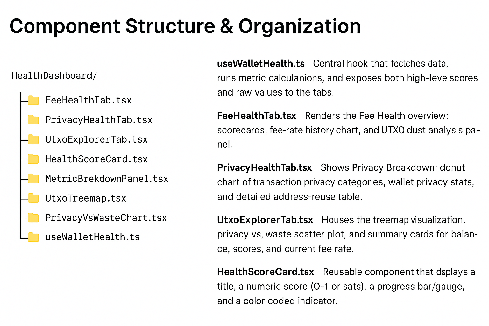
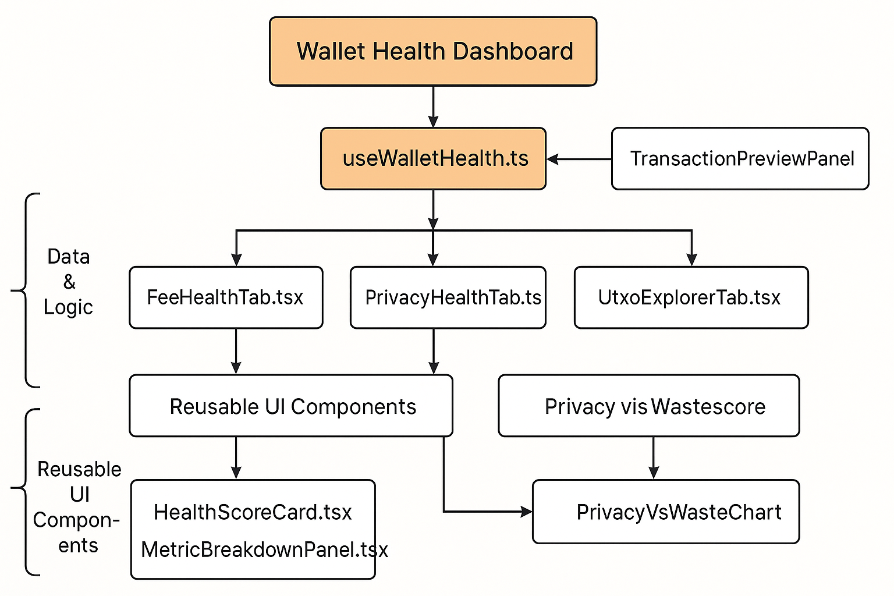

# Wallet Health Dashboard

A powerful analytics tool for Caravan users to monitor and improve their multisig wallet health through privacy, fee optimization, and UTXO management metrics.




## Overview

The Wallet Health Dashboard provides Bitcoin multisig wallet users with an intuitive interface to analyze and improve their wallet's health. By focusing on key metrics related to privacy, fee optimization, and UTXO management, the dashboard delivers actionable insights in a user-friendly format.

## Key Features

### Fee Health Analysis
- **Fee Scorecards**: Color-coded indicators of transaction fee efficiency
- **Fee-Rate History Chart**: Visualize fee trends over time
- **UTXO Dust Analysis**: Identify inefficient UTXOs that increase transaction costs

### Privacy Health Metrics
- **Privacy Category Breakdown**: Donut chart visualization of privacy metrics
- **Address Reuse Analysis**: Statistics on address reuse patterns
- **Detailed Privacy Stats**: In-depth metrics on wallet privacy health

### UTXO Explorer
- **Treemap Visualization**: Interactive representation of your UTXO set
- **Privacy vs. Waste Scatter Plot**: Balance analysis between privacy and fee waste
- **Balance Overview**: Assessment of wallet balance distribution

### Transaction Preview Panel
- **Pre-signing Analysis**: Privacy and fee efficiency feedback on unsigned PSBTs
- **Risk Assessment**: Identification of potential privacy compromises before transaction signing

## Architecture

The dashboard is built with modular, reusable components:

```
src/
├── hooks/
│   └── useWalletHealth.ts     # Core logic for health metric calculations
├── components/
│   ├── tabs/
│   │   ├── FeeHealthTab.tsx   # Fee optimization interface
│   │   ├── PrivacyHealthTab.tsx  # Privacy metrics interface
│   │   └── UtxoExplorerTab.tsx   # UTXO visualization interface
│   ├── common/
│   │   ├── HealthScoreCard.tsx   # Reusable score indicators
│   │   └── MetricBreakdownPanel.tsx  # Detailed metrics panels
│   └── visualizations/
│       ├── UtxoTreemap.tsx    # UTXO set visualization
│       └── PrivacyVsWasteChart.tsx  # Privacy/efficiency balance chart
└── utils/
    └── metrics.ts           # Helper functions for metric calculations
```

