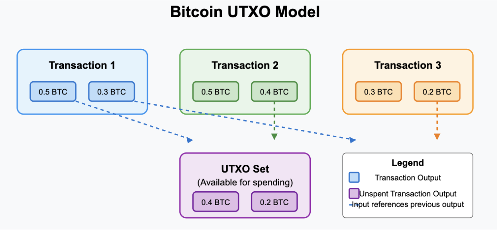
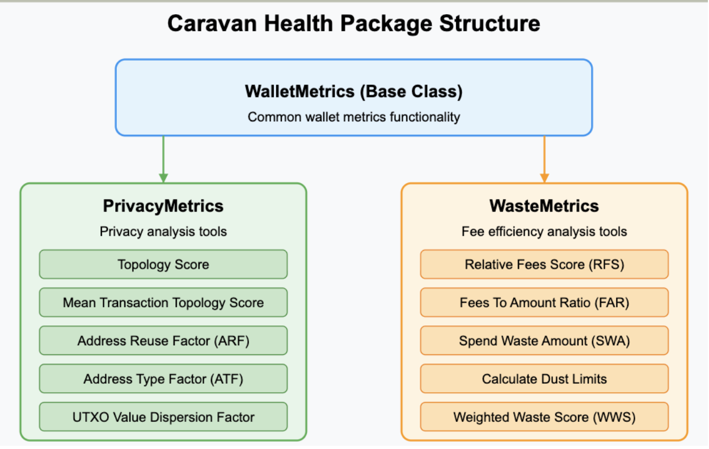
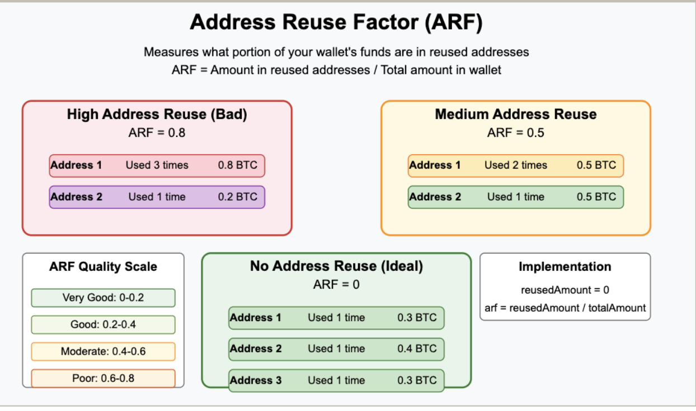

# Caravan Health

A toolkit for analyzing and improving the health of Bitcoin wallets, focusing on privacy and fee efficiency metrics.

## 📊 Overview

Caravan Health helps you evaluate the "health" of Bitcoin wallets through two key dimensions:

1. **Privacy** - How well your transaction history protects your financial privacy
2. **Waste** - How efficiently you're managing transaction fees and UTXOs

This package works alongside the Caravan Bitcoin multisig coordinator to provide real-time feedback on wallet health.

## 🚀 Features

### Privacy Analysis
- Transaction topology scoring
- Address reuse detection
- Address type diversity analysis
- UTXO distribution assessment

### Fee Efficiency Analysis
- Spend waste calculation
- Fee rate comparison
- UTXO economic viability
- Dust limit detection

### Visualization
- Health score dashboards
- UTXO explorer with clustering visualization
- Transaction analysis panel

## UTXO Model
Bitcoin doesn't use an account-based system like traditional banking. Instead, it uses the UTXO (Unspent Transaction Output) model:
Each transaction consumes previous transaction outputs as inputs
Each transaction creates new outputs that can be spent in future transactions
Your wallet's "balance" is the sum of all UTXOs you control



### Fee Efficiency Concerns
Bitcoin users pay fees to get their transactions included in blocks. Several factors affect fee efficiency:
Size of the transaction (number and types of inputs/outputs)
Current network congestion
How UTXOs are managed over time
Inefficient fee management can lead to unnecessary costs, which is the second major focus of Caravan Health.
Caravan Health Package Structure
Let's look at the main components of the Caravan Health package:


The package consists of:
- WalletMetrics (Base Class) - Common functionality for all metrics
- PrivacyMetrics - Extends WalletMetrics with privacy-related analysis
- WasteMetrics - Extends WalletMetrics with fee efficiency analysis
Now, let's dive into each of these components in detail.

### Privacy Metrics
The PrivacyMetrics class provides tools to assess the privacy of Bitcoin transactions and wallets. Let's explore each metric:
Transaction Topology and Spend Types
Bitcoin transactions can be categorized based on their structure (inputs and outputs), which affects privacy:


Let's see a simplified example of how the topology score is calculated:
```typescript
// Example for a Perfect Spend (1 input, 1 output)
const spendType = determineSpendType(1, 1); // Returns SpendType.PerfectSpend
const baseScore = getSpendTypeScore(1, 1);  // Returns 0.5

// If this is a self-payment (sending to yourself), a deniability factor can apply
const finalScore = isSelfPayment ? baseScore * DENIABILITY_FACTOR : baseScore;
// DENIABILITY_FACTOR = 1.5, so finalScore could be 0.75 if it's a self-payment
```

### Address Reuse Factor (ARF)
Address reuse is one of the biggest privacy issues in Bitcoin. Ideally, you should use a new address for every transaction. The Address Reuse Factor measures how much of your wallet's balance is in reused addresses:



The formula for Address Reuse Factor is:
ARF = Amount in reused addresses / Total wallet amount
Where an address is considered "reused" if it appears more than once in transaction outputs.
For example:
If 80% of your funds are in reused addresses, ARF = 0.8 (Very Poor)
If 50% of your funds are in reused addresses, ARF = 0.5 (Moderate)
If none of your funds are in reused addresses, ARF = 0 (Very Good)
The code implementation in Caravan Health analyzes all UTXOs and looks at how many times the corresponding addresses have been used:

```typescript
addressReuseFactor(): number {
  let reusedAmount: number = 0;
  let totalAmount: number = 0;
  const utxos = this.utxos;
  
  for (const address in utxos) {
    const addressUtxos = utxos[address];
    for (const utxo of addressUtxos) {
      totalAmount += utxo.value;
      const isReused = this.isReusedAddress(address);
      if (isReused) {
        reusedAmount += utxo.value;
      }
    }
  }
  
  return reusedAmount / totalAmount;
}
```

### Address Type Factor (ATF)
Bitcoin has evolved to support multiple address types, each with different characteristics:
- P2PKH: Legacy addresses (starting with "1")
- P2SH: Script hash addresses (starting with "3")
- P2WSH: Segregated witness script hash addresses (starting with "bc1q")
- P2TR: Taproot addresses (starting with "bc1p")
Mixing different address types can improve privacy by making your transactions harder to identify. The Address Type Factor measures this diversity:
ATF = 1 / (number of same address types + 1)
For example:
If all your transactions use the same address type, ATF = 0.5
If 3 outputs match the wallet's address type out of 10 total, ATF = 0.25
The more diverse your address types, the higher your ATF (better privacy)

### UTXO Spread Factor and UTXO Value Dispersion Factor
These metrics evaluate how diverse your UTXO values are:


### UTXO Spread Factor (USF)
The UTXO Spread Factor measures how diverse your UTXO values are:
USF = σ / (σ + 1)
Where σ (sigma) is the standard deviation of UTXO values.
Low USF (near 0): UTXOs have very similar values (worse for privacy)
High USF (near 1): UTXOs have diverse values (better for privacy)
For example:
A wallet with [0.1, 0.15, 0.1, 0.15, 0.2, 0.1] BTC UTXOs has a standard deviation of 0.04 → USF = 0.038 (Poor)
A wallet with [0.1, 0.5, 0.02, 1.0, 5.0, 0.005] BTC UTXOs has a standard deviation of 1.77 → USF = 0.639 (Good)
UTXO Mass Factor (UMF)
The UTXO Mass Factor evaluates how many UTXOs you have:
- 0-4 UTXOs: UMF = 1.0 (Not ideal)
- 5-14 UTXOs: UMF = 0.75 (Good)
- 15-24 UTXOs: UMF = 0.5 (Better)
- 25-49 UTXOs: UMF = 0.25 (Very good)
- 50+ UTXOs: UMF = 0 (Excellent)
Having more UTXOs generally improves privacy by giving you more flexibility.
UTXO Value Dispersion Factor (UVDF)
This combines the Spread Factor and Mass Factor:
UVDF = (USF + UMF) * 0.15 - 0.15
UVDF ranges from -0.15 to 0.15, where:
Negative values indicate poor UTXO distribution
Positive values indicate good UTXO distribution
Overall Wallet Privacy Score
The getWalletPrivacyScore method combines all these factors to calculate an overall privacy score:
```typescript
getWalletPrivacyScore(walletAddressType: MultisigAddressType, network: Network): number {
  const MTPS = this.getMeanTopologyScore();
  const ARF = this.addressReuseFactor();
  const ATF = this.addressTypeFactor(walletAddressType, network);
  const UVDF = this.utxoValueDispersionFactor();

  const WPS = (MTPS * (1 - 0.5 * ARF) + 0.1 * (1 - ARF)) * (1 - ATF) + 0.1 * UVDF;
  return WPS;
}
```
This formula gives:
- More weight to transaction topology scores
- Penalties for address reuse
- Adjustments based on address type diversity
- Small adjustments for UTXO distribution

## Waste Metrics
Now let's explore the WasteMetrics class, which focuses on fee efficiency and UTXO management:


### What is Spend Waste Amount (S.W.A)?
The Spend Waste Amount is a heuristic used in Bitcoin wallets to evaluate whether it's efficient to spend a UTXO now or wait. It helps decide:
- Should I spend this UTXO now at today’s fee rate?
- Or should I wait until later, when the fee rate might be lower?


## 📊 Metrics Explanation

### Privacy Metrics

| Metric | Description | Range | Ideal Value |
|--------|-------------|-------|-------------|
| Transaction Topology Score | Privacy based on tx structure | 0-1 | Higher |
| Address Reuse Factor (ARF) | Funds in reused addresses | 0-1 | Lower |
| Address Type Factor (ATF) | Address type diversity | 0-1 | Lower |
| UTXO Spread Factor (USF) | Diversity of UTXO values | 0-1 | Higher |
| UTXO Value Dispersion Factor | Overall UTXO distribution | -0.15-0.15 | Higher |
| Wallet Privacy Score | Combined privacy rating | 0-1 | Higher |

### Waste Metrics

| Metric | Description | Range | Ideal Value |
|--------|-------------|-------|-------------|
| Spend Waste Amount (SWA) | Efficiency of spending now vs later | Any (sats) | Lower |
| Relative Fees Score (RFS) | Fee efficiency vs network | 0-1 | Higher |
| Fees to Amount Ratio (FAR) | Fees as % of transaction value | 0-1 | Lower |
| Weighted Waste Score | Combined fee efficiency rating | 0-1 | Higher |


## 📝 Usage Examples

### Improving Privacy

```typescript
// Get UTXO value distribution
const utxoDistribution = privacyMetrics.getUtxoDistributionStats();

// Find reused addresses
const reusedAddresses = privacyMetrics.getReusedAddresses();

// Suggest improvements
console.log(`Number of reused addresses: ${reusedAddresses.length}`);
console.log(`UTXO distribution standard deviation: ${utxoDistribution.standardDeviation}`);
```

### Optimizing Fee Efficiency

```typescript
// Get potential waste for consolidation transaction
const consolidationWaste = wasteMetrics.calculateConsolidationWaste(
  smallUtxos,
  currentFeeRate,
  estimatedLongTermFeeRate
);

// Determine optimal time to consolidate
const shouldConsolidate = consolidationWaste < 0;

console.log(`Consolidation waste: ${consolidationWaste} sats`);
console.log(`Recommended action: ${shouldConsolidate ? 'Consolidate now' : 'Wait for lower fees'}`);
```

# Fee‐Efficiency: WasteMetrics

This document describes the `WasteMetrics` class, designed to analyze the fee efficiency of wallet transactions based on historical data and transaction details.

The `WasteMetrics` class extends `WalletMetrics` and provides several methods to calculate fee-related efficiency scores.

```typescript
export class WasteMetrics extends WalletMetrics { 
  // ... methods described below ... 
}

## Metrics Overview
Here are the key metrics provided by the WasteMetrics class:

1. Relative Fees Score (RFS)
```typescript
relativeFeesScore(history: FeeRatePercentile[]): number {
  let sum = 0, count = 0;
  for (const tx of this.transactions) {
    if (tx.isSend) {
      count++;
      const rate = this.getFeeRateForTransaction(tx);
      sum += this.getFeeRatePercentileScore(tx.block_time, rate, history);
    }
  }
  return count ? sum/count : 0;
}
```
Description:

Calculates the Relative Fees Score (RFS). For each outgoing transaction, this function determines where the paid fee rate sat within the distribution of fee rates in the block it was confirmed in (based on historical FeeRatePercentile data). It then averages these percentile scores across all outgoing transactions to produce a final score between 0 and 1. A higher RFS suggests that the wallet consistently pays competitive fees relative to the network conditions at the time of each transaction.

2. Fees-to-Amount Ratio (FAR)
```typeScript

feesToAmountRatio(): number {
  let totalRatio = 0, count = 0;
  for (const tx of this.transactions) {
    if (tx.isSend) {
      // Note: Ensure tx.amount represents the intended spend amount, 
      // not the total output value which might include change.
      totalRatio += tx.fee / tx.amount; 
      count++;
    }
  }
  return count ? totalRatio/count : 0;
}
```
Description:

Measures the average ratio of the fee paid to the amount spent for outgoing transactions. This helps identify if transaction fees constitute a significant percentage (e.g., >1%) of the value being transferred, providing insight into the cost-effectiveness of spending operations.

3. Spend Waste Amount (SWA)
```typeScript
spendWasteAmount(
  weight: number,           // Weight of the UTXO being spent (e.g., its value in satoshis)
  feeRate: number,          // Current fee rate (e.g., satoshis per virtual byte)
  inputSum: number,         // Total value of inputs used in the transaction
  spendAmount: number,      // The actual amount intended to be sent (excluding change)
  estLongTermRate: number   // Estimated long-term average fee rate
): number {
  // Cost associated with creating change or not using the input optimally
  const cost = Math.abs(spendAmount - inputSum); 
  // Compares current fee rate cost vs long-term rate cost, scaled by UTXO weight
  // Adds the cost of suboptimal input selection (change creation)
  return weight * (feeRate - estLongTermRate) + cost;
}
```
Description:

Estimates the potential "waste" associated with spending a specific UTXO (or set of inputs) at the current fee rate compared to waiting for a potentially different future fee rate.

If the current feeRate is lower than the estLongTermRate, the first part of the calculation is negative, suggesting it might be beneficial to spend/consolidate now (potential negative SWA if cost is low).
If the current feeRate is higher, the first part is positive, indicating potential savings by waiting for lower fees (positive SWA).
The cost term adds waste incurred due to factors like creating change outputs when inputSum doesn't match spendAmount.
4. Dust Limits
```typeScript

calculateDustLimits(
  feeRate: number,                   // Current fee rate (e.g., satoshis per vbyte)
  scriptType: MultisigAddressType,   // Type of script (e.g., P2SH, P2WSH, P2TR)
  { requiredSignerCount, totalSignerCount }: { 
      requiredSignerCount: number; 
      totalSignerCount: number; 
  }, // Multisig parameters if applicable
  riskMultiplier = 2                 // Multiplier for the upper limit buffer
): { lowerLimit: number; upperLimit: number } {
  
  // --- Placeholder for actual vsize calculation ---
  // This part needs to compute the virtual size (vsize) required 
  // to spend an output of the given scriptType. 
  // This depends heavily on the specifics of the script (P2PKH, P2SH, P2WPKH, P2TR, etc.)
  // and potentially the multisig parameters.
  // Example: const vsize = estimateSpendingVsize(scriptType, { requiredSignerCount, totalSignerCount }); 
  let vsize = 100; // Replace with actual calculation based on scriptType
  // --- End Placeholder ---

  // The minimum value an output needs to have to be worth spending at the current fee rate.
  const lower = vsize * feeRate; 
  
  // An upper limit providing a buffer, based on risk tolerance.
  return { lowerLimit: lower, upperLimit: lower * riskMultiplier };
}
```
Description:

Computes the economic "dust" limits for a UTXO based on the current feeRate and the script type (which determines the cost to spend it).

lowerLimit: The minimum value (in satoshis) an output must have for the cost of spending it (fee) not to exceed its value. Outputs below this are generally considered uneconomical to spend at the given fee rate.
upperLimit: Provides a buffer above the strict dust limit, determined by the riskMultiplier. UTXOs between the lower and upper limits might be considered marginal depending on risk tolerance and future fee expectations.
5. Weighted Waste Score (WWS)
```typeScript
weightedWasteScore(history: FeeRatePercentile[]): number {
  const RFS = this.relativeFeesScore(history); // How competitive were your fees? (0-1)
  const FAR = this.feesToAmountRatio();       // How much did fees cost relative to sends? (Ratio)
  
  // Assumes a method `utxoMassFactor` exists, possibly measuring UTXO fragmentation or similar.
  // Needs definition - Placeholder value used.
  const UMF = this.utxoMassFactor ? this.utxoMassFactor() : 0.5; // Example: (0-1)

  // Weighted average combining different efficiency aspects.
  // Weights (0.35, 0.35, 0.3) should sum to 1.
  // Note: FAR is a ratio, not inherently 0-1. It might need normalization 
  // or careful interpretation in this weighted sum.
  // Consider clamping or transforming FAR if necessary.
  return 0.35 * RFS + 0.35 * Math.min(FAR, 1) + 0.3 * UMF; // Example with FAR clamped
}
```

## 🔄 Metrics Component Lifecycle

Understanding the complete lifecycle of a component is crucial for adding new elements:

1. **Initialization**  
   - **Constructor** accepts raw data sources: transaction history, UTXO sets, fee‐rate percentiles, network parameters, etc.  
   - Internal data structures (maps, caches) are created for fast lookup.

2. **Data Ingestion & Validation**  
   - Wallet data is loaded from the simulator or live node.  
   - Inputs are validated (e.g. checking all UTXOs belong to known addresses).

3. **Metric Computation**  
   - The component’s core method (e.g. `getTopologyScore()`, `relativeFeesScore()`) is invoked over each transaction or UTXO.  
   - Intermediate values are cached to avoid recomputation in bulk analyses.

4. **Aggregation & Scoring**  
   - Individual transaction/UTXO scores are combined into a single metric (e.g. MTPS, WPS, WWS).  
   - Weighting factors are applied and normalized to the expected range [0–1].

5. **API Exposure**  
   - Computed scores and raw sub‐metric values are exposed via REST endpoints (`/health/privacy`, `/health/waste`).  
   - Endpoints accept query parameters for network, address type, time ranges, etc.

6. **UI Rendering**  
   - React components fetch the JSON payloads and render:  
     - **Scorecards** (Privacy & Waste)  
     - **Treemap** (UTXO explorer)  
     - **Charts** (time‐series of historical scores)  
     - **Transaction Panel** (per‐tx topology & waste breakdown)

7. **User Interaction & Update**  
   - On user actions (filtering time windows, selecting different wallets, changing coin‐selection strategies), the UI re‐requests updated metrics.  
   - Components highlight changes (e.g. hover to show raw sub‐scores, drag‐to‐compare multiple wallets).

8. **Persistence & Export**  
   - Users can export full reports (JSON, CSV) or snapshot images of dashboards.  
   - Session settings (selected metrics, date ranges) are saved in local storage or user profile.

9. **Extension**  
   - **New Metric:** subclass `WalletMetrics`, implement `compute()` and any helper methods.  
   - **Register:** add to the metric‐factory and API router.  
   - **Visualize:** create or update a React component, wire it to your new endpoint, and add chart or scorecard layout.  
   - **Document:** update `docs/coin-selection.md` or `docs/health-api.md` with definitions, formulas, and expected ranges.

--- 

