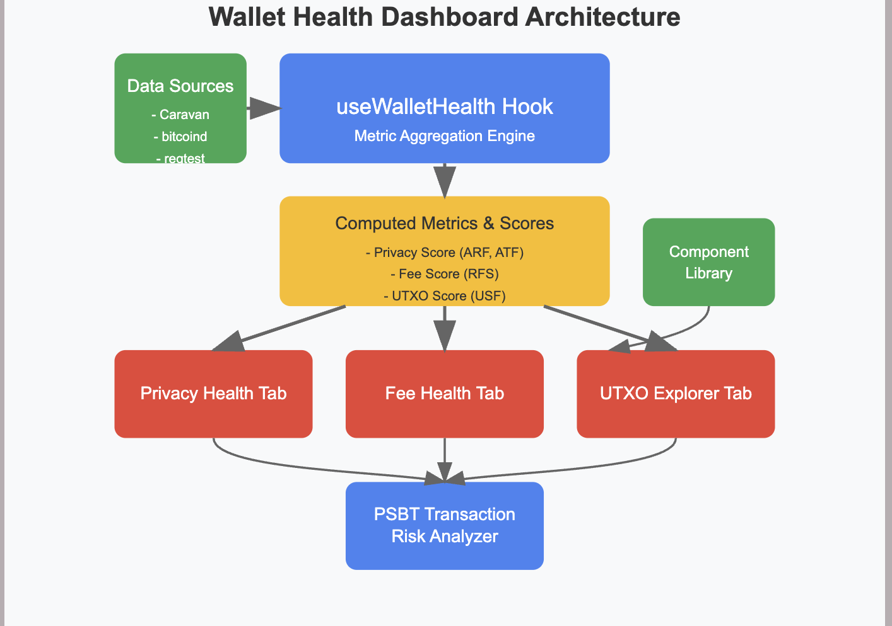

# Wallet Health Dashboard

A comprehensive Bitcoin wallet analysis tool that provides insights into wallet privacy, fee efficiency, and UTXO management.

## Overview

The Wallet Health Dashboard project creates a robust and deterministic engine for calculating Bitcoin wallet health metrics. The dashboard provides visual insights into wallet behavior across multiple dimensions, helping users make informed decisions about their Bitcoin security and efficiency practices.

## 🔧 Core Components

### 1. Metric Aggregation and Health Score Engine

A central hook (`useWalletHealth.ts`) designed to ingest wallet data, analyze historical transactions, and produce both summary-level health scores and raw metrics. These metrics reflect wallet status in terms of privacy, fee management, and UTXO set quality.

#### Objectives
- Design a flexible and scalable hook to calculate wallet health indicators
- Ensure deterministic and testable results using regtest
- Enable seamless data consumption by downstream components
- Support multiple wallet types and multisig configurations

#### Core Functionality
- **Wallet Data Fetching**: Interface with Caravan's internal structure and local bitcoind node
- **Metric Computation**: Calculate key indicators like Address Reuse Factor, Fee Strategy, and UTXO Set Freshness
- **Health Scoring**: Normalize metrics into actionable scores between 0-1
- **Data Exposure**: Provide both high-level summaries and detailed breakdowns

### 2. Modular Dashboard Tabs for Wallet Health

Distinct tabs organize and present scores, charts, and insights:
- `PrivacyHealthTab.tsx`
- `FeeHealthTab.tsx`
- `UtxoExplorerTab.tsx`

### 3. Interactive Visualizations

Visual components using D3/Recharts:
- UTXO treemaps
- Privacy vs. waste scatter plots
- Fee history trends

### 4. Transaction Risk Analyzer

A sidebar/modal that previews unsigned transactions (PSBTs) and highlights potential privacy or efficiency issues before broadcasting.

### 5. Component Library for Health Insights

Reusable components like `HealthScoreCard` and `MetricBreakdownPanel` to ensure consistency across the UI.

## 🧪 Testing Environment

The project uses Bitcoin's regtest mode to provide a controlled environment for testing and development:
- Simulate wallet usage patterns
- Mine blocks on-demand for predictable state transitions
- Validate metrics under various controlled wallet histories

## 📊 Architecture Design

The architecture follows a clean separation of concerns pattern:
1. Central data processing hook (`useWalletHealth.ts`)
2. Consistent data exposure (scores, metrics, raw data)
3. Specialized UI components consuming the processed data
