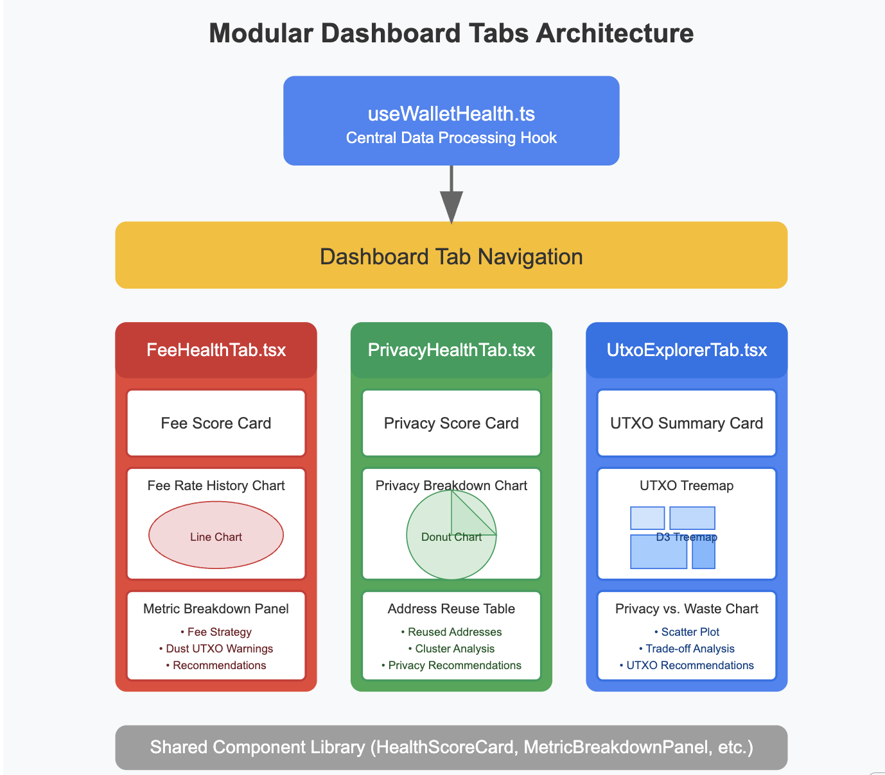

# Modular Dashboard Tabs for Wallet Health

## 🌐 Overview

A core design principle of the Wallet Health Dashboard is clarity, modularity, and separation of concerns. The dashboard renders wallet health data through dedicated tabs, each responsible for a specific dimension of wallet quality: fees, privacy, and UTXO set management. These tabs not only display high-level scores and alerts but also offer in-depth visual breakdowns and panels to help users interpret what's happening with their multisig wallet, especially during collaborative PSBT signing flows.

Implemented in React using a component-driven structure, each tab relies on shared state and data processing logic from `useWalletHealth.ts`. The tabs serve as high-level UI "modules" that group relevant health indicators together, using charts, scorecards, and panels for comprehensive visualization.

## 🎯 Goals of the Modular Tab Design


- **Visual Segregation of Concepts**: Users can focus on one type of health concern at a time—privacy, fees, or UTXOs.
- **Progressive Disclosure of Detail**: Surface summary scores and alerts, with collapsible panels or modals for further insights.
- **Ease of Testing and Extending**: Modular components make it easier to debug, test, or add new sub-metrics.
- **Seamless Integration with React State**: All tabs consume shared state from `useWalletHealth.ts`, avoiding redundant data fetching or recomputation.

## 📁 Components Overview

### 1. FeeHealthTab.tsx

- Displays fee-related scorecards, such as the wallet's average paid fee rate, waste from overpaying, and transactions with below-minimum fees
- Includes a fee-rate history chart visualizing the trend of past transaction fees
- Features a dust UTXO analysis panel, which checks whether the wallet is spending fees on uneconomical UTXOs

### 2. PrivacyHealthTab.tsx

- Presents a privacy breakdown donut chart, categorizing transactions by their level of privacy (e.g., perfect, adequate, poor)
- Shows metrics like address reuse count, address types, and cluster entropy
- Includes a detailed table that shows reused addresses and links them to affected transactions

### 3. UtxoExplorerTab.tsx

- Renders a UTXO treemap, allowing users to visually explore how funds are distributed
- Displays a Privacy vs. Waste scatter plot, showing trade-offs made in historical transactions
- Shows a summary card grouping balance, UTXO count, health scores, and current suggested fee rate

## 🧩 Modular UI Structure

Each tab is built around a consistent layout philosophy:

```
┌────────────────────────────┐
│ Tab Header & Overview      │
│ Scorecards & Summary       │
├────────────────────────────┤
│ Main Visualizations        │
│  • Chart or Treemap        │
│  • Donut or Scatter Plot   │
├────────────────────────────┤
│ Collapsible Panels         │
│  • Metric Breakdown Panel  │
│  • Reused Address Table    │
│  • UTXO Warnings Panel     │
└────────────────────────────┘
```

## 🖼️ Example: FeeHealthTab

```tsx
<FeeHealthTab>
  <HealthScoreCard title="Fee Score" value={score} />
  <FeeRateHistoryChart data={feeHistory} />
  <MetricBreakdownPanel
    title="Recent Fee Strategy"
    metrics={rfsMetrics}
  />
  <DustUtxoWarningPanel utxos={dustSet} />
</FeeHealthTab>
```

This encapsulated approach allows for clean, declarative UI code and reusable building blocks across tabs.

## 📊 Data Flow

All tabs consume the data from the `useWalletHealth` hook. For instance, when a user opens the `PrivacyHealthTab`, the component accesses the privacy metrics already computed by the centralized hook. This ensures:

- No repeated computation
- Centralized unit testing for metric logic
- Clean unidirectional data flow

## 📁 Component Breakdown

| Component | Used In | Description |
|-----------|---------|-------------|
| HealthScoreCard | All Tabs | Displays metric score, color-coded gauge, and title |
| MetricBreakdownPanel | Fee & Privacy Tabs | Collapsible panel listing sub-metrics like ARF, RFS |
| UTXOTreemap | UtxoExplorerTab | D3-based visualization of wallet's UTXO structure |
| PrivacyVsWasteChart | UtxoExplorerTab | Scatter plot showing privacy-efficiency trade-offs |
| DustUtxoWarningPanel | Fee Tab | Lists small UTXOs that degrade fee performance |
| AddressReuseTable | Privacy Tab | Tabular display of reused addresses and impact |

