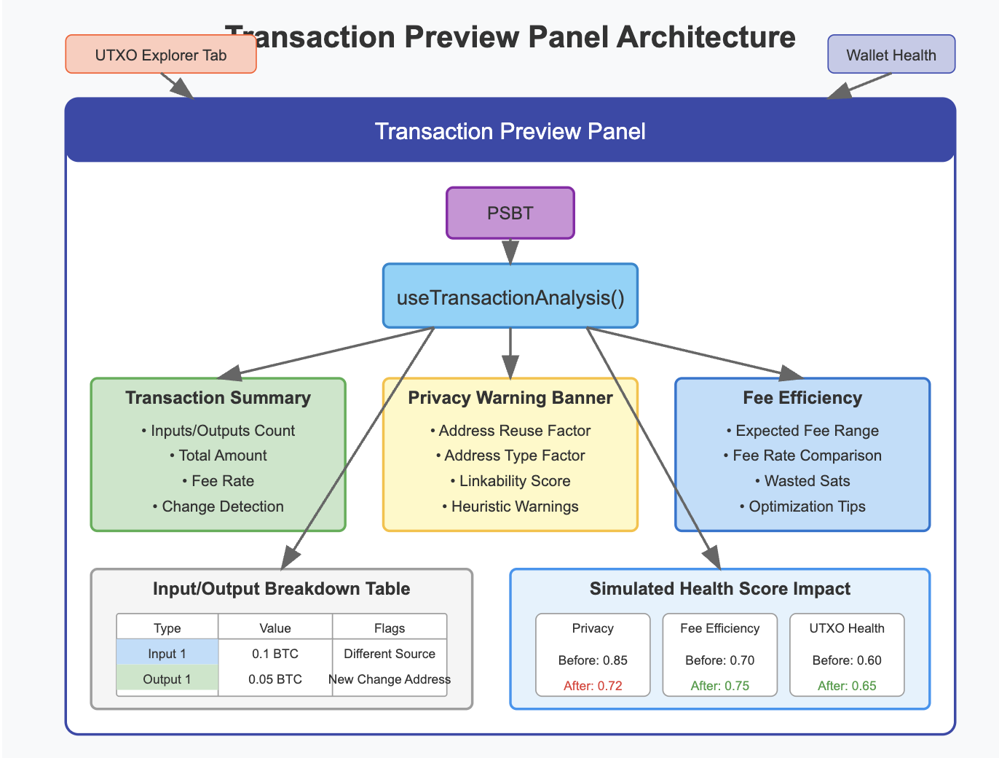

# Transaction Preview Panel for Pre-Signing Evaluation

## 📌 Overview

One of the most critical moments in a Bitcoin transaction lifecycle is the pre-signing phase—the point at which a user crafts or reviews a partially signed Bitcoin transaction (PSBT). Mistakes at this point, especially in multisig setups, can result in loss of privacy, excessive fees, or even unintended fund movement.

To mitigate these risks, the Wallet Health Dashboard introduces a **Transaction Preview Panel**—a dedicated UI component that analyzes a PSBT draft in real-time and provides actionable feedback on privacy, efficiency, and structural issues before the user signs the transaction. This feature empowers users to make well-informed decisions and promotes healthy transaction crafting behavior.

## 🎯 Goals of the Preview Panel


The Transaction Preview Panel aims to:

- Evaluate PSBTs dynamically before signing
- Surface warnings related to privacy leaks, inefficient input selection, or address reuse
- Provide metrics that quantify transaction waste and privacy
- Offer a user-friendly, visual representation of the transaction internals
- Educate users on best practices through inline tooltips and learn-more links

This bridges the gap between expert-level Bitcoin knowledge and user-level understanding, offering multisig users a transparent lens into what they are about to sign.

## 🧩 Integration in the Dashboard

This panel is integrated in a modal or sidebar layout and can be invoked from any part of the dashboard where a PSBT is being viewed or edited—especially in the UtxoExplorerTab, or when reviewing transaction history or simulating coin selection.

It leverages shared state from the `useWalletHealth` hook and hooks directly into the PSBT builder service or any incoming draft passed into the app.

## 🔍 Key Features and Components

### 1. Transaction Summary Section

Displays key fields from the PSBT:
- Number of inputs and outputs
- Total input and output amount
- Fee and fee rate
- Change address presence and type

Highlights dangerous patterns:
- Unreasonable fee rate
- Absence of change output
- Outputs to known reused addresses

Example: "Warning: This transaction has no change output. This may leak privacy and waste funds."

### 2. Privacy Warning Banner

Analyzes the transaction using metrics like:
- Address Reuse Factor (ARF)
- Address Type Factor (ATF)
- Linkability Score (e.g., same input address reused across outputs)

Flags issues like:
- Inputs from different clusters
- Outputs that match input types
- Heuristic triggers (e.g., round-number payments, non-standard output ordering)

Banners change color based on severity: green (safe), yellow (acceptable), red (critical risk).

### 3. Fee Efficiency Section

Shows:
- Expected fee range for mempool priority
- Your fee rate vs. network average
- Wasted sats due to inefficient input choice

Recommends optimizations:
- Drop high-fee UTXOs
- Merge dust prior to sending

This helps users who may not understand fee dynamics make smarter choices while still respecting urgency.

### 4. Input/Output Breakdown Table

List view of:
- Each input with value, cluster ID, address reuse flags
- Each output with recipient type, change flag, and tag

Color-coded cells:
- Inputs from different sources (blue)
- Reused change outputs (red)
- Change to new address (green)

Toggle to expand for script types, derivation paths, and address indexes.

### 5. Simulated Health Score Impact

When previewing a transaction, the app temporarily recalculates wallet health assuming the transaction is signed and broadcast.

Shows updated scores for:
- Privacy
- Waste
- Cluster consistency

Lets user simulate alternative outcomes without risk.

## 🧠 How it Works Under the Hood

The `TransactionPreviewPanel` pulls in the PSBT either directly from user upload or from the wallet's draft state.

The `useTransactionAnalysis()` hook parses the PSBT and computes:
- Script-level privacy indicators
- Cluster-based heuristics
- Fee-to-size ratio
- Address linkability patterns

This data is rendered by `HealthScoreCard`, `MetricBreakdownPanel`, and tabular views.

Panel is memoized to prevent re-renders on unrelated state changes.

## 💻 Implementation Example

```tsx
// TransactionPreviewPanel.tsx
import React, { useMemo } from 'react';
import { useWalletHealth } from '../hooks/useWalletHealth';
import { useTransactionAnalysis } from '../hooks/useTransactionAnalysis';
import { HealthScoreCard } from '../components/HealthScoreCard';
import { MetricBreakdownPanel } from '../components/MetricBreakdownPanel';
import { InputOutputTable } from '../components/InputOutputTable';

interface TransactionPreviewPanelProps {
  psbtHex: string;
  onClose: () => void;
}

export const TransactionPreviewPanel: React.FC<TransactionPreviewPanelProps> = ({ 
  psbtHex,
  onClose 
}) => {
  // Analyze the PSBT
  const { 
    summary,
    privacyScore,
    feeEfficiency,
    inputs,
    outputs,
    warnings,
    simulatedHealthImpact
  } = useTransactionAnalysis(psbtHex);
  
  // Get current wallet health metrics
  const { scores: currentScores } = useWalletHealth();
  
  // Memoize expensive calculations
  const privacyImpact = useMemo(() => {
    return {
      before: currentScores.privacy,
      after: simulatedHealthImpact.privacy,
      change: simulatedHealthImpact.privacy - currentScores.privacy
    };
  }, [currentScores.privacy, simulatedHealthImpact.privacy]);
  
  return (
    <div className="transaction-preview-panel">
      <h2>Transaction Preview</h2>
      
      {/* Summary Section */}
      <div className="summary-section">
        <h3>Summary</h3>
        <p>Inputs: {summary.inputCount} | Outputs: {summary.outputCount}</p>
        <p>Total Input: {summary.inputAmount} BTC</p>
        <p>Total Output: {summary.outputAmount} BTC</p>
        <p>Fee: {summary.fee} BTC ({summary.feeRate} sat/vB)</p>
        {summary.hasChangeOutput ? (
          <p className="success">✓ Includes change output</p>
        ) : (
          <p className="warning">⚠️ No change output detected</p>
        )}
      </div>
      
      {/* Privacy Warning Banner */}
      <div className={`privacy-banner ${privacyScore.severity}`}>
        <h3>Privacy Assessment</h3>
        <p>{privacyScore.message}</p>
        {warnings.map((warning, i) => (
          <p key={i} className="warning-item">⚠️ {warning}</p>
        ))}
      </div>
      
      {/* Fee Efficiency Section */}
      <div className="fee-section">
        <h3>Fee Efficiency</h3>
        <p>Current Mempool Range: {feeEfficiency.mempoolRange}</p>
        <p>Your Fee Rate: {feeEfficiency.yourRate}</p>
        <p>Potential Waste: {feeEfficiency.wastedSats} sats</p>
        {feeEfficiency.recommendations.map((rec, i) => (
          <p key={i} className="recommendation">💡 {rec}</p>
        ))}
      </div>
      
      {/* Input/Output Breakdown */}
      <InputOutputTable inputs={inputs} outputs={outputs} />
      
      {/* Simulated Impact */}
      <div className="impact-section">
        <h3>Impact on Wallet Health</h3>
        <div className="impact-scores">
          <HealthScoreCard 
            title="Privacy Impact"
            before={privacyImpact.before}
            after={privacyImpact.after}
            change={privacyImpact.change}
          />
          {/* Other impact scores... */}
        </div>
      </div>
      
      <button className="close-button" onClick={onClose}>Close Preview</button>
    </div>
  );
};
```

